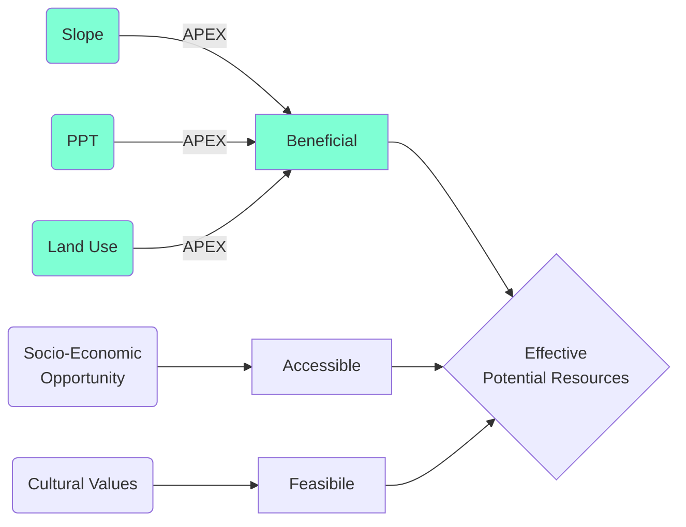
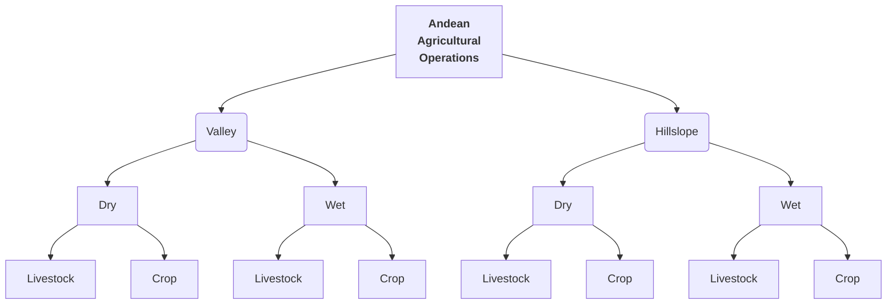
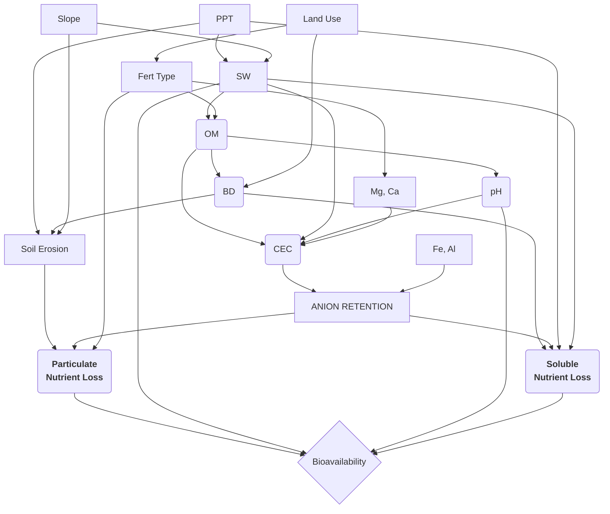

Homework #2																	Lauren Bomeisl


Research Objectives

- What is the current range of characteristics representative of land management of subsistence agriculture and in-stream water quality at the headwaters in the Ambato river watershed?
- How do hydrologic and nutrient transport processes respond to changes in land use specific to management practices in the Ecuadorian Andes for permanent grass, crop cultivation, and cattle grazing over annual time scales?
- How do hydrologic and nutrient transport processes differ between operations on steep hill slopes (30%) and mild valley slopes (5%) provided land use, precipitation, and soils that are representative of the Ecuadorian Andes.
- Which resources could most effectively inform land management to reduce nutrient losses for the climatic, cultural, and topographic conditions that currently exist in the Ecuadorian Andes?



This study only explores potential resources based on agronomic benefits, such that the mitigation of nutrient loss from field to stream enhances nutrient use efficiency. Additional conditions to consider regarding effective resources, including accessibility and feasibility, are not addressed in this study, but are acknowledged as equivocally valuable and an opportunity for future research in this region. 



This flow chart can be used to consider potential resources for informed land management based on topographic, hydrologic, and agronomic characteristics. The potential resources suggested for each outcome are based on biogeochemical and hydrologic conditions which determine nutrient transport processes as illustrated in the following path diagram. 



```MERMAID
graph TD

%%TD: top down, LR: left right

A[Hard edge] -->B(<b>Round edge)

    B --> C{Decision}

    C -->|One| D[Result <br/> <b>one</b>]

    %%<br/> line break

    %%<b> bold and end </b> for one word

    C -.->|Two| E[<b>Result</b> two]

   D ==> A

   D -.->B

```


Increasing OM: Residue, Manure, NOT slash and burn, planting pits (for arid regions)

​	enhancing soil aggregation

​	reducing anion retention

Reducing Erosion: Residue, Cover Crops, NOT bare fallow, NOT overgraze, NOT slash and burn
