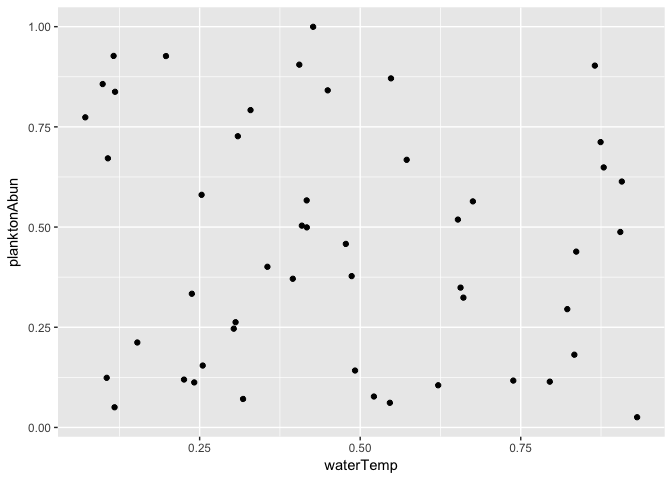
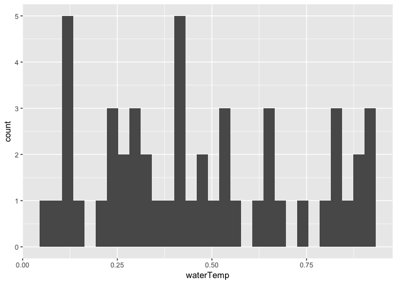

## R Markdown

## More LaTex tricks

$$\sum_{i=1}^S{n_i}=N$$

### Sentence text

$$p(\mbox{Occurrence of species X})=0.67$$

###Escaping the backslash

$$\backslash a \le b \backslash$$

Rendering code of \LaTex


```r
library(ggplot2)
waterTemp <- runif(50)
planktonAbun <- runif(50)
qplot(x=waterTemp, y=planktonAbun)
```

<!-- -->

```r
# print(waterTemp)
# head(waterTemp)
# tail(waterTemp)
```

Now we can add text here, say anything we wat, etc. because we are no longer in R but back in the world of 'markdown'. 


```r
qplot(x=waterTemp)
```

```
## `stat_bin()` using `bins = 30`. Pick better value with `binwidth`.
```

<!-- -->
