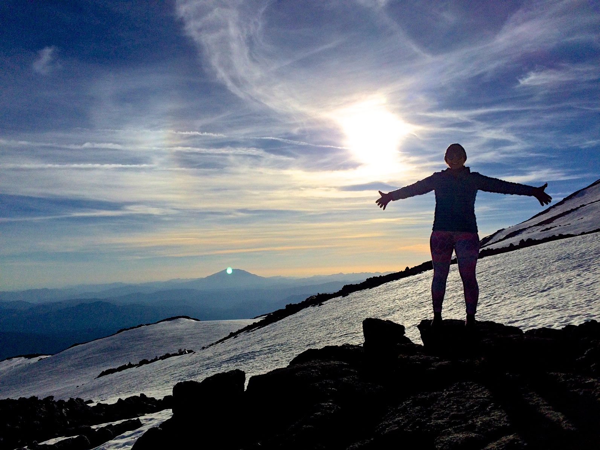
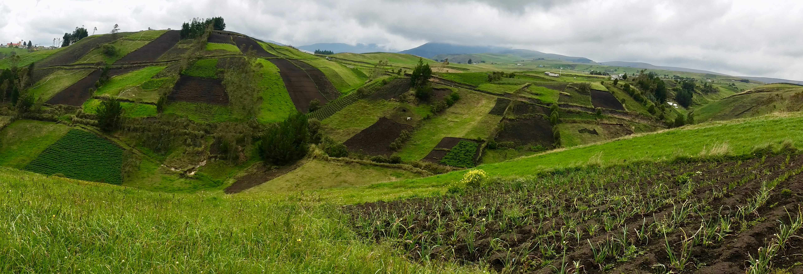

```{r setup, include=FALSE}
knitr::opts_chunk$set(echo = TRUE)
```

 
<git clone https://github.com/renyunz/leonids>
<cd leonids>
<jekyll server>
 




#Welcome! Stay A While!
* Contact: lauren.bomeisl@uvm.edu 

## About Lauren
MS Water Resources Engineering, Oregon State University  
BS Physics, SUNY Geneseo

Lauren is a first year PhD student working in Dr. Eric Roy's Nutrient Cycling and Ecological Design (NCED) lab. She is broadly interested in agronomic, socio-economic, and environmental impacts of resource recovery and reuse (RRR) systems. More specifically, her research is focused on agronomic characteristics that result from the application of fertilizer products derived from organic waste. Lauren has previously worked with tropical P-retentive soils, and is also interested in observing how soil quality can be restored to enhance yield efficiency through the use of nutrient recovered products. Additionally, the NCED lab is developing a spatial analysis of Phosphorus supply and demand within a region to inform sustainable RRR business models. Lauren is planning to use R for statistical analyses regarding soil, crop, and leachate characterization. 



##Assignments
* Assignment 1: [create website](https://laurenbomeisl.github.io/Bio381_2018/)
* Assignment 2: [create flowcharts](180309_Homework_02.html)
* Assignment 3: [Beamer presentation](Homework_3.pdf)
* Assignment 4: [Matrix Operations]()
* Assignment 5: [Find and Replace](Homework_5.html)

##Nutrient Cycling and Ecological Design Lab
[Check us out!](http://nced.weebly.com/)


